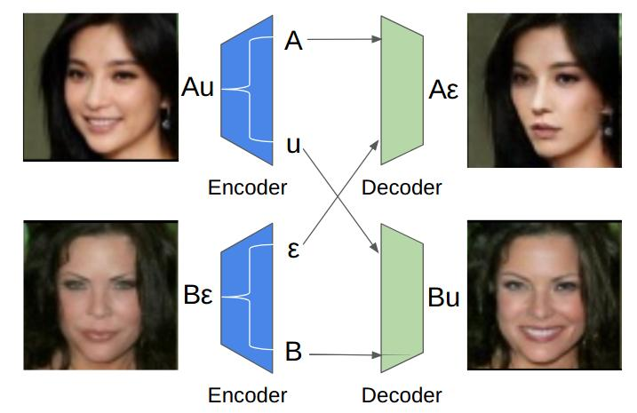

# GeneGAN in PyTorch

### Introduction

This is the re-implemented source code for the paper [GeneGAN: Learning Object Transfiguration
and Attribute Subspace from Unpaired Data](https://arxiv.org/abs/1705.04932v1). We reproduce the results using PyTorch.

<div align="center">

</div>
<br/>

### Installation
- Install python libraries
  ```
  pip3 install -r requirements.txt
  ```

### Dataset Preparation
- Download [celebA](http://mmlab.ie.cuhk.edu.hk/projects/CelebA.html) dataset and unzip it into
`datasets` directory. There are various source providers for CelebA datasets. To ensure that the
size of downloaded images is correct, please run `identify datasets/celebA/data/000001.jpg`. The
size should be 409 x 687 if you are using the same dataset. Besides, please ensure that you have
the following directory tree structure.
  ```
  ├── datasets
  │   └── celebA
  │       ├── data
  │       ├── list_attr_celeba.txt
  │       ├── list_eval_partition.txt
  │       └── list_landmarks_celeba.txt
  ```

- Run `python3 preprocess.py`. It will take several miniutes to preprocess all face images.
A new directory `datasets/celebA/align_5p` will be created.

### GeneGAN train/test (Attribute migration)
- Choose an attribute for training/testing (The optional attributes are: Eyeglasses | Bangs | Male | Mouth_Slightly_Open | No_Beard ..., we select Bangs as the attribute in the following example)
  ```bash
  make train TASK='Bangs'      # Train
  make show_train TASK='Bangs' # Show train details
  make test TASK='Bangs'       # Test
  make show_test TASK='Bangs'  # Show test details
  ```

### Citation
- If you use this code for your research, please cite our paper:
  ```
  @inproceedings{DBLP:conf/bmvc/ZhouXYFHH17,
    author    = {Shuchang Zhou and
                Taihong Xiao and
                Yi Yang and
                Dieqiao Feng and
                Qinyao He and
                Weiran He},
    title     = {GeneGAN: Learning Object Transfiguration and Attribute Subspace from Unpaired Data},
    booktitle = {Proceedings of the British Machine Vision Conference (BMVC)},
    year      = {2017},
    url       = {http://arxiv.org/abs/1705.04932},
    timestamp = {http://dblp.uni-trier.de/rec/bib/journals/corr/ZhouXYFHH17},
    bibsource = {dblp computer science bibliography, http://dblp.org}
  }
  ```

### Acknowledgements
This code borrows heavily from [pytorch-CycleGAN-and-pix2pix](https://github.com/junyanz/pytorch-CycleGAN-and-pix2pix)

